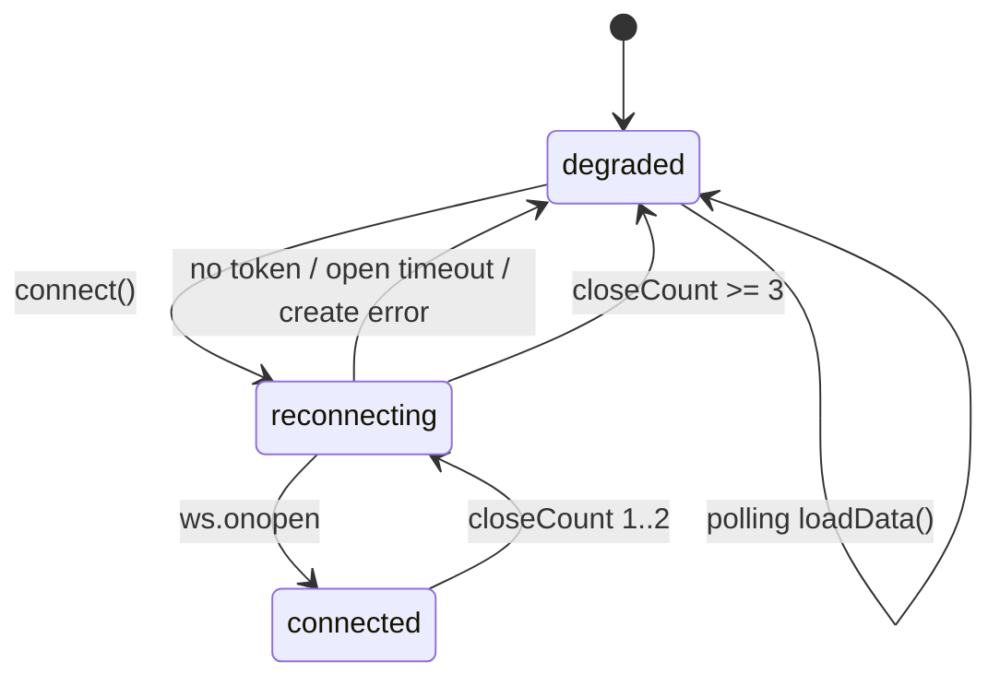

# Frontend baseline — Phase 6

Дата прогона: 2026-05-24.

Фаза выполнялась без правок production-кода. Цель документа - зафиксировать текущие frontend code paths для пунктов реестра 32, 43, 44, 45, 46 и смежных runtime-механизмов, чтобы regression anchors были честной точкой отсчёта.

## WS reconnect (п. 32)

Источник: `frontend/src/store/ws.ts`.

`WsRuntime.connect()` переводит состояние в `reconnecting`, останавливает fallback polling и запрашивает одноразовый WS-token через `getToken()`. Если токена нет, `createSocket()` бросил ошибку или сокет не открылся за 5 секунд, runtime вызывает `startFallback()`.

Важный baseline: `startFallback()` только ставит `state = degraded` и запускает `setInterval(loadData, 10000)`. В fallback-таймере нет periodic healing-вызова `connect()`, поэтому после трёх закрытий UI остаётся в polling до ручного reload или нового внешнего `connect()`.

Что покрыто тестами в этом диалоге:
- `frontend/src/store/__tests__/ws.spec.ts`: happy open, no-token fallback, open timeout fallback, malformed message keeps socket alive, close -> reconnect, `closeCount >= 3` -> fallback, fallback polling without auto-reconnect.
- Существующий `frontend/src/store/ws.test.ts`: backoff, protocol formatting, fallback timer, clear CSRF on session rotation.
- `frontend/tests/e2e/ws-reconnect.spec.ts`: `test.fixme` как e2e XFAIL для п. 32 до production-фикса healing reconnect.

Что остаётся XFAIL до фикса:
- Автовозврат из `degraded` в `connected` без перезагрузки страницы.

## MigrateXui apply error UX (п. 43)

Источник: `frontend/src/views/MigrateXui.vue`.

`applyPlan()` выставляет synthetic progress, переводит wizard на шаг 3 и отправляет `api/import-xui/apply`. Если ответ `success=false`, код делает только `this.step = 2` и `return`. Локального поля ошибки нет; пользователь зависит от toast из `HttpUtils`, а сам wizard не сохраняет причину отказа рядом с планом.

`setImport(item, enabled)` меняет action на `skip`, `create` или текущую `strategy`, но не хранит историю ручных изменений. После apply-fail пользователь возвращается на шаг 2 с теми же mutable plan-items, без явного объяснения, что именно откатилось или почему apply не прошёл.

Что покрыто тестами в этом диалоге:
- `docs/audit/frontend/baseline.md` фиксирует current behavior и UX gap.
- `frontend/tests/e2e/migrate-xui-happy.spec.ts` содержит `test.fixme`, потому что полноценный сценарий требует `test-db/x-ui.db` и `test-db/s-ui.db`.

Что остаётся XFAIL до фикса:
- Inline-ошибка на шаге review после failed apply.
- E2E проверка текста причины отказа после API error.

## MigrateXui rollback reload race (п. 44)

Источник: `frontend/src/views/MigrateXui.vue`.

`rollback()` отправляет `api/import-xui/rollback`, снимает `rollbackLoading`, затем при успехе ждёт фиксированную 1 секунду и вызывает `location.reload()`. Это baseline race: backend может ещё не завершить restart/reload path, а frontend уже перезагрузится и увидит старое или промежуточное состояние.

Что покрыто тестами в этом диалоге:
- `frontend/tests/e2e/migrate-xui-happy.spec.ts` содержит rollback XFAIL внутри общего MigrateXui сценария.
- Phase 5 уже закрепила server-side rollback-adjacent latency/rate-limit anchor; frontend health-check polling остаётся отдельным будущим фикс-path.

Что остаётся XFAIL до фикса:
- Ожидание health-check/reload-ready endpoint вместо `setTimeout(1000)`.

## MigrateXui password reveal (п. 45)

Источник: `frontend/src/views/MigrateXui.vue`.

При наличии `report.generatedAdmins` UI показывает предупреждение `passwordShownOnce`, но сразу рендерит весь массив через `JSON.stringify(report.generatedAdmins, null, 2)`. Это baseline leakage pattern: generated passwords появляются в DOM, screenshot/log capture и browser accessibility tree без явного reveal-действия.

Что покрыто тестами в этом диалоге:
- `frontend/tests/e2e/migrate-xui-happy.spec.ts` содержит XFAIL-проверку desired behavior: пароль должен быть скрыт по умолчанию и раскрыт только явным действием.
- `frontend/tests/e2e/a11y.spec.ts` включает страницу миграции в axe-smoke, если локальная панель доступна.

Что остаётся XFAIL до фикса:
- Click-to-reveal и auto-clear для `generatedAdmins`.

## AdminMode UI/contract (п. 46)

Источник: `frontend/src/views/MigrateXui.vue`.

`adminModeItems` всегда показывает `skip`, `new_password`, `reset_required`. Frontend отправляет выбранное значение в `buildPlan()` как `adminMode`. По реестру backend не реализует отдельную семантику `reset_required`: current contract сходится к генерации нового пароля и помещению его в report, как у `new_password`.

Fallback-семантика сейчас не выражена в UI: `reset_required` не disabled, нет warning о backend contract gap, а пользователь может выбрать режим, который выглядит безопаснее, чем фактическое backend-поведение.

Что покрыто тестами в этом диалоге:
- `frontend/tests/e2e/migrate-xui-happy.spec.ts` содержит XFAIL для adminMode contract до фикса п. 2/46.

Что остаётся XFAIL до фикса:
- `reset_required` должен быть disabled или сопровождаться явным предупреждением, пока backend не поддерживает force-password-reset contract.

## Realtime applyRealtimeEvent

Источник: `frontend/src/store/ws.ts`.

`applyRealtimeEvent()` обрабатывает только известные типы:
- `onlines`: если есть payload, заменяет `Data().onlines`.
- `xui_import_progress`: пишет `Ws().xuiImportProgress`.
- `config_invalidated` и `reload`: вызывает `Data().loadData()`.

Unknown event types молча игнорируются. Это безопасно для forward compatibility, но pitfall для диагностики: typo в event type не виден в UI, тестах или telemetry. Malformed JSON ловится внутри `ws.onmessage` и не закрывает соединение.

Что покрыто тестами в этом диалоге:
- `frontend/src/store/__tests__/ws.spec.ts`: malformed message не вызывает `onEvent` и не ломает runtime.
- Existing in-process Go integration anchors уже проверяют server-side publish/WS lifecycle.

Что остаётся XFAIL до фикса:
- Наблюдаемость unknown event types, если продуктово нужно логирование/метрика.

## csrfStore + httputil

Источники: `frontend/src/store/csrf.ts`, `frontend/src/plugins/api.ts`, `frontend/src/plugins/httputil.ts`.

`csrfStore` хранит token и in-flight promise в module scope. `getCSRFToken()` переиспользует token, coalesces параллельные запросы и защищается `csrfTokenGeneration`, чтобы `clearCSRFToken()` не позволил старому promise заново записать token после очистки. Явного expiry timestamp на клиенте нет; expiry задаётся сервером, а клиент чистит token при session-rotation WS close или 403 `Invalid CSRF token`.

`api.ts` добавляет CSRF token для mutating `api/*` запросов, кроме `api/login`. GET/HEAD/OPTIONS dedupe идут через `AbortController`: новый идентичный idempotent request abort'ит предыдущий. При 403 `Invalid CSRF token` вызывается `clearCSRFToken()`, но автоматического retry/replay нет. 401-specific retry тоже отсутствует в baseline.

`httputil.ts` приводит axios response/error к `Msg`, показывает toast для success/fail, suppresses toast для canceled duplicate requests и вызывает `logout()` только для backend-msg `Invalid login`.

Что покрыто тестами в этом диалоге:
- `frontend/src/store/__tests__/csrf.spec.ts`: set/get через `getCSRFToken`, coalescing, `clearCSRFToken`, generation guard.
- `frontend/src/plugins/__tests__/httputil.spec.ts`: get/post response mapping, invalid-login logout path, backend error body handling, canceled request suppression.
- `frontend/src/plugins/__tests__/api.spec.ts`: CSRF header injection, login exception, duplicate GET AbortController, 403 invalid-CSRF clear.
- Existing `frontend/src/plugins/httputil.test.ts`: duplicate cancellation toast suppression and real error toast.

Что остаётся XFAIL до фикса:
- Client-side token expiry timestamp отсутствует.
- Automatic retry after CSRF refresh / 401 отсутствует и не добавлялся в Phase 6.
